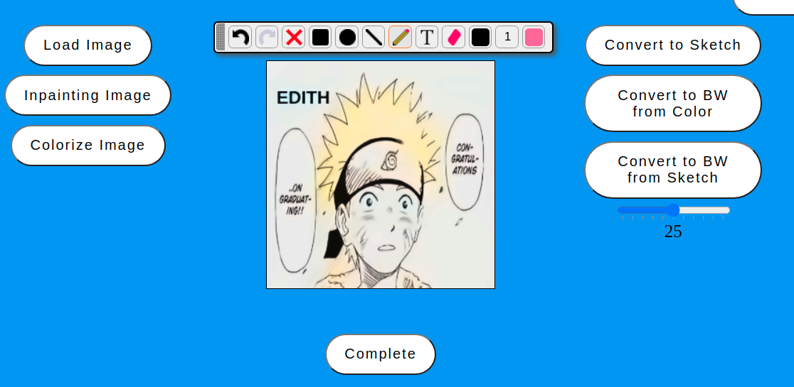
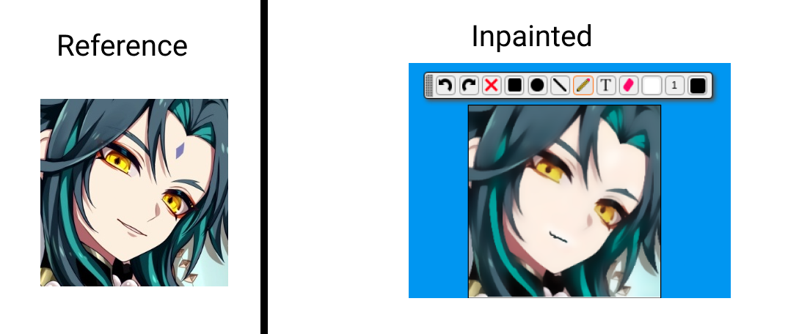
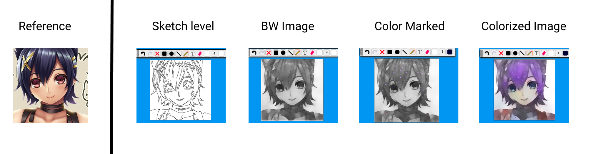

# AI-Powered Anime Photo Editing Web App



## Members

- **Machine Learning**: 칭기스
- **Backend Developer:** 박수헌, 공허
- **Frontend Developer**: 김은민, 공허


# Objective

- Provide a user-friendly web application that edits images quickly and with minimal user effort.
# Requirements
- Pytorch > 1.7
- opencv
- Django
# How to run
1. Clone this repo
2. Download 3 files (https://drive.google.com/drive/folders/1CzI2phQFXHfC837MO_TnqXrmzlG3j_BL?usp=sharing)
3. Locate 3 files(color.tar, sketch.tar, inpaint.tar) at ./EDITH/api/
4. run commands
```
cd EDITH
python manage.py migrate
python manage.py runserver
```
5. Open web brower
6. Connect to "localhost:8000"


# Features

- Image Inpainting
- Image colourizing 
- Sketch to Image Conversion

# Examples


