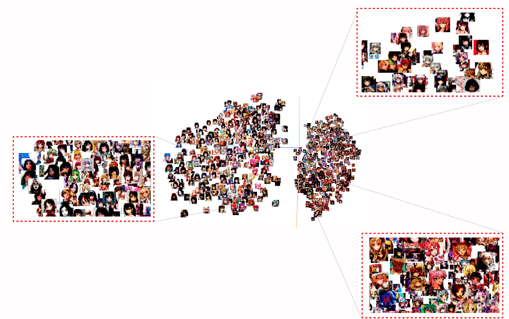

# Unsupervised Feature Learning via Non-parameteric Instance Discrimination
# Training script github 
- https://github.com/zhirongw/lemniscate.pytorch
# Checkpont
- https://drive.google.com/file/d/1zYC87yP6G45cwfvakcwWFFJbZwrY13_-/view?usp=sharing
# Visualization

# How to run kNN
* Download checkpoint
* run: python mine.py --reference DIR1 --query DIR2 --store DIR3
